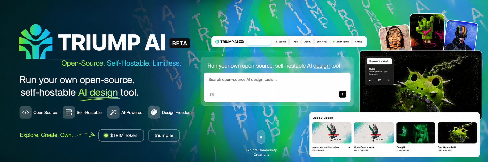

<p align="center">
  
</p>

<h1 align="center">TRIUMP AI</h1>

<p align="center">
  <b>A curated launchpad for open-source, self-hostable AI design tools.</b><br>
  Clone a repo, run it on your own machine, and own your entire creative stack — reuse, remix, and scale, with <b>zero lock-in</b>.
</p>

<p align="center">
  <a href="https://triump.xyz">🌐 triump.xyz</a> &nbsp;·&nbsp;
  <a href="./PRD.md">📄 PRD</a> &nbsp;·&nbsp;
  <a href="./token.html">🪙 $TRIM Token</a>
</p>

<p align="center">
  
  
  
</p>

---

## ✨ What is this?

**TRIUMP AI** is a curated hub of the best **open-source, self-hostable AI design tools** (three.js, ComfyUI, Hydra, p5.js, ChatGL, Dyad, Onlook, bolt.diy, tldraw make-real, and more). Instead of renting a cloud SaaS, you browse the catalog, learn what each tool does, and run it yourself — your data, your machine, your rules.

Backed by the community memecoin **$TRIM** on Solana.

## 🖼️ Preview

| | | |
|:-:|:-:|:-:|
|  |  |  |
| **three.js** | **ComfyUI** | **Hydra** |
|  |  |  |
| **p5.js** | **ShaderGif** | **Dyad** |

## 🚀 Features

- **5 pages** — Home, Tools, Self-Host, About, Token — dark, on-brand (neon green + light blue).
- **Tool catalog** with live **search** overlay and image **lightbox**.
- **Auto-rotating** featured carousel + shuffling gallery thumbnails.
- **Gradient typewriter** manifesto and a smooth running marquee.
- **$TRIM token page** with a live launch countdown (**11 June 2026 · 5:00 PM UTC**), copy-CA, and buy links.
- **Email OTP sign-in** (password-less) via `noreply@triump.xyz`.
- **Phantom wallet** connect (connect-only).

## 🧰 Tech stack

- **Frontend:** plain HTML + CSS + vanilla JS (no build step).
- **Backend:** PHP 7.4+ — dependency-free SMTP client, file-based OTP store (no database).
- **Hosting:** Hostinger (shared) + domain `triump.xyz`.

## 📁 Project structure

```
.
├── index.html              # Home
├── tools.html              # Catalog
├── self-host.html          # Self-host guide
├── about.html              # About
├── token.html              # $TRIM token
├── pages.css / pages.js    # shared styles + lightbox/countdown (sub-pages)
├── auth.js                 # OTP login modal + Phantom connect (all pages)
├── index-B1Pu6_EC.css      # precompiled styles for the home page
├── logo.png / logo-trans.png / favicon.png
├── img/                    # tool & showcase images
├── api/                    # PHP backend
│   ├── config.example.php  # copy → config.php and fill SMTP password
│   ├── send-otp.php        # email a 6-digit code
│   ├── verify-otp.php      # verify code → session
│   ├── me.php / logout.php
│   └── _smtp.php / _store.php
└── storage/                # OTP store (web-blocked, gitignored)
```

## 🛠️ Run locally (static preview)

The marketing pages are static — just open `index.html` in a browser, or:

```bash
# any static server works; for the PHP auth you need PHP:
php -S localhost:8000
# then visit http://localhost:8000
```

> Login/OTP needs PHP running. Phantom connect works in any browser with the Phantom extension.

## ☁️ Deploy to Hostinger

1. In **hPanel → File Manager**, open `public_html`.
2. Upload **everything except** `_archive/`, `assets/`, and `docs/` (those are local sources, not needed live).
3. **Create the email** `noreply@triump.xyz` (hPanel → Emails).
4. Copy `api/config.example.php` → `api/config.php` and set `smtp_pass` to that email's password.
5. Point the domain `triump.xyz` to Hostinger (nameservers or A record).
6. Visit https://triump.xyz 🎉

### Email OTP config (`api/config.php`)
```php
'smtp_host' => 'smtp.hostinger.com',
'smtp_port' => 465,            // 465 = SSL, 587 = STARTTLS
'smtp_user' => 'noreply@triump.xyz',
'smtp_pass' => 'YOUR_EMAIL_PASSWORD',
```

## 🔐 Security notes

- Secrets (`api/config.php`) and the OTP store (`storage/otps.json`) are **gitignored**.
- `storage/` is blocked from the web (`.htaccess`) and OTPs are hashed at rest.
- OTP: 6 digits · 10-min expiry · 5 attempts · 45s resend cooldown.

## 🪙 $TRIM

Community memecoin on Solana. Launch: **11 June 2026 · 5:00 PM UTC**. Contract address and buy links go live on the [token page](./token.html).

## 📜 License

MIT — see `LICENSE`. Tool names, logos, and linked repositories belong to their respective owners.
